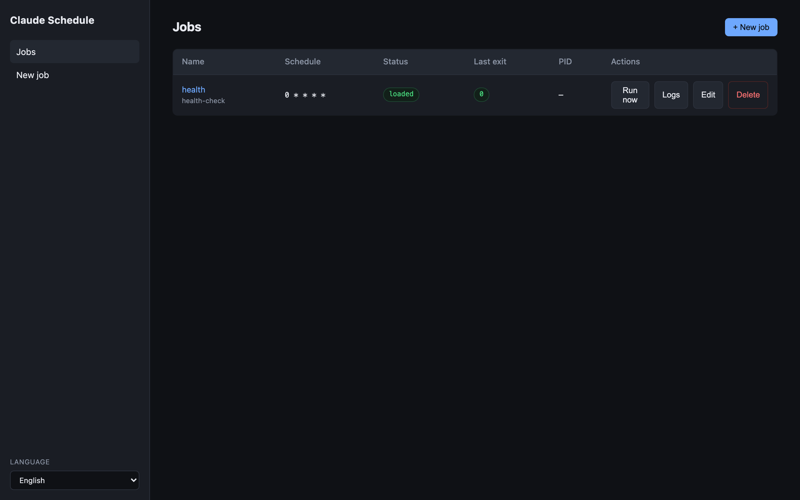
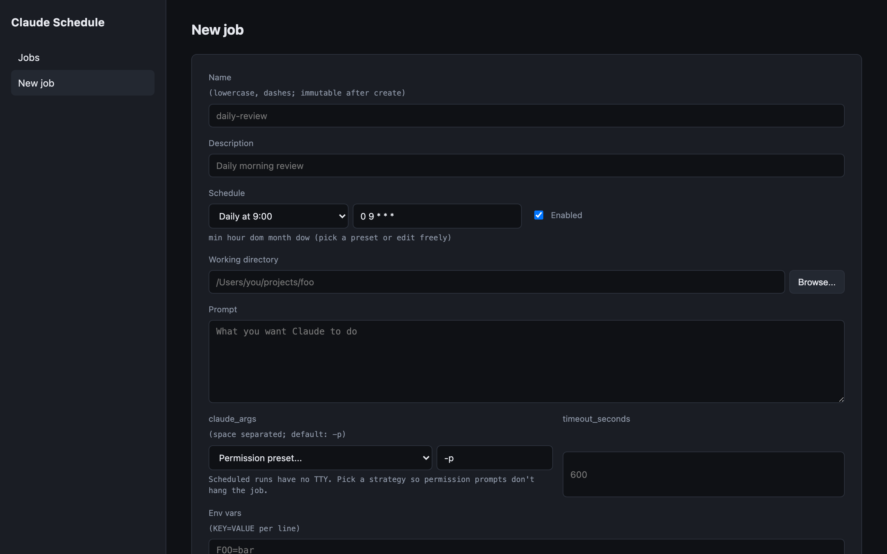
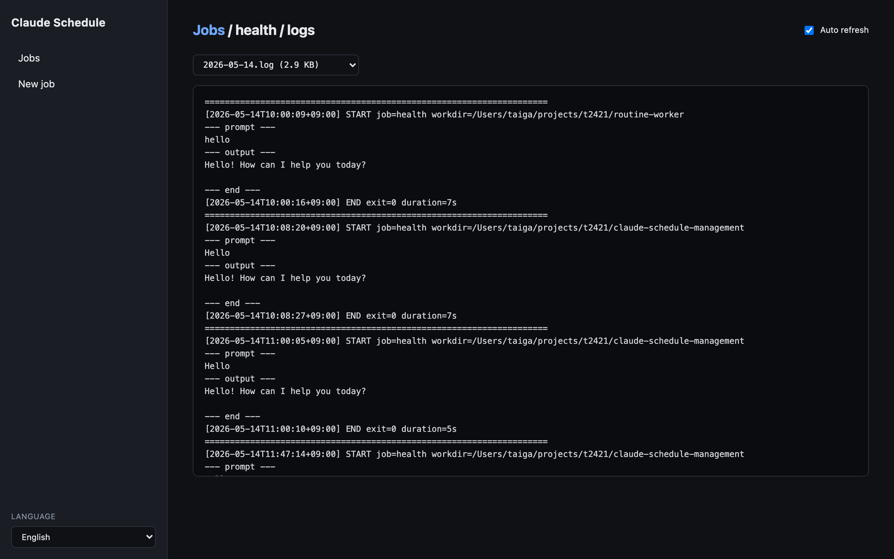

# claude-schedule-management

> **macOS only.** A small local web service for scheduling [Claude Code](https://docs.anthropic.com/claude/docs/claude-code) prompts via `launchd`.
>
> 🇯🇵 [日本語版 README](README.ja.md)

Manage all your scheduled Claude prompts from one browser tab. YAML is the
source of truth, the web UI just edits it.

## Screenshots

| Jobs list                                       | New / edit job                                | Log viewer                                      |
| ----------------------------------------------- | --------------------------------------------- | ----------------------------------------------- |
|  |  |  |

```
┌─ web UI (React) ──── HTTP ──── Hono API ─────┐
│   /jobs                        ├─ jobs/*.yaml  (source of truth)
│   /jobs/:name                  ├─ plists/*    (generated)
│   /jobs/:name/logs             └─ logs/*      (per-job append)
└──────────────────────────────────────────────┘
        ▲
        │ launchctl bootstrap / bootout / kickstart
        ▼
   ~/Library/LaunchAgents/local.claude-schedule.job.*.plist
        │
        ▼ scheduled time
   bin/runner.sh <job-name>  →  claude -p "<prompt>"
                             →  logs/<job>/YYYY-MM-DD.log
```

## Features

- Browser UI for listing, creating, editing, and deleting jobs
- 5-field cron schedule with built-in presets (hourly, daily 9:00, weekdays, etc.)
- Native macOS folder picker for the working directory
- Run any job immediately ("Run now" button, internally `launchctl kickstart`)
- Per-day log files with auto-refresh viewer
- Orphan detection — surfaces launchd entries that have no YAML counterpart
- English / Japanese UI (i18n)
- All local, no telemetry, binds `127.0.0.1` only

## Requirements

- macOS (this is the only supported scheduler backend today — see [ROADMAP.md](ROADMAP.md))
- Node 20+
- [`yq`](https://github.com/mikefarah/yq) — `brew install yq`
- [`claude` CLI](https://docs.anthropic.com/claude/docs/claude-code) — Claude Code

Run the dependency check:

```bash
bin/doctor.sh
```

## Install

```bash
git clone https://github.com/t2421/claude-schedule-management.git
cd claude-schedule-management
npm install
npm run build
bin/install-service.sh
open http://127.0.0.1:7878
```

`install-service.sh` writes `~/Library/LaunchAgents/local.claude-schedule.service.plist`
and loads it with `launchctl`. The service starts at login.

To uninstall:

```bash
bin/uninstall-service.sh
```

## Development

```bash
npm run dev
# → API: http://127.0.0.1:7878
# → web (Vite, with HMR): http://localhost:5173  (proxies /api to 7878)
```

To run only the UI against an already-installed background service:

```bash
npm --workspace web run dev
```

### Tests

```bash
npm test
```

## How it works

1. `jobs/<name>.yaml` is the source of truth.
2. Saving from the UI writes the YAML, generates
   `plists/local.claude-schedule.job.<name>.plist`, symlinks it into
   `~/Library/LaunchAgents/`, and `launchctl bootstrap`s it.
3. When the scheduled time arrives, launchd executes
   `bin/runner.sh <name>`.
4. The runner reads the YAML via `yq`, `cd`s into `working_directory`, and
   runs `claude -p "<prompt>"`.
5. stdout / stderr / exit code are appended to
   `logs/<name>/YYYY-MM-DD.log`.

## Job YAML

```yaml
name: daily-review
description: Morning review of yesterday's work
enabled: true
schedule:
  cron: "0 9 * * *" # minute hour dom month dow
working_directory: /Users/you/projects/foo
prompt: |
  Look at yesterday's progress and propose today's tasks.
claude_args: ["-p"]
env:
  EXTRA: value
timeout_seconds: 600
```

See [`jobs/examples/`](jobs/examples) for more.

### Scheduled job permission strategy

Scheduled runs happen without a TTY. If the prompt triggers a tool that asks
for permission, no one is there to answer — the job will either fail or hang.
Pick one of these strategies and bake it into `claude_args`:

| Strategy             | `claude_args`                                                                    | Risk   | When                                             |
| -------------------- | -------------------------------------------------------------------------------- | ------ | ------------------------------------------------ |
| Plan only (safest)   | `["-p", "--permission-mode", "plan"]`                                            | Lowest | Read-only review / proposals                     |
| Limited allowlist    | `["-p", "--allowedTools", "Read,Grep,Glob"]`                                     | Low    | Inspect-a-repo style jobs                        |
| Bypass permissions   | `["-p", "--dangerously-skip-permissions"]`                                       | High   | Trusted automation with full FS / network access |
| Per-project settings | `["-p"]` + a `.claude/settings.json` in the working dir with `permissions.allow` | Medium | Granular, project-tracked rules                  |

The UI offers these as presets next to the `claude_args` field. Always set
`timeout_seconds` as a safety net — install GNU coreutils
(`brew install coreutils`) so the runner can enforce it with `gtimeout`.

### Supported cron syntax

5-field (`minute hour dom month dow`):

| Form    | Meaning            |
| ------- | ------------------ |
| `*`     | wildcard           |
| `N`     | exact value        |
| `A,B,C` | list               |
| `A-B`   | inclusive range    |
| `*/N`   | step (e.g. `*/15`) |

Internally translated to launchd's `StartCalendarInterval` array.

## Configuration

Set via environment variables in
`~/Library/LaunchAgents/local.claude-schedule.service.plist` (or for
development, in your shell):

| Variable                        | Default                         | Description                   |
| ------------------------------- | ------------------------------- | ----------------------------- |
| `PORT`                          | `7878`                          | API port                      |
| `HOST`                          | `127.0.0.1`                     | Bind address                  |
| `CLAUDE_SCHEDULE_LABEL_PREFIX`  | `local.claude-schedule.job`     | launchd label prefix for jobs |
| `CLAUDE_SCHEDULE_SERVICE_LABEL` | `local.claude-schedule.service` | launchd label for the service |

## Project layout

```
claude-schedule-management/
├── server/      Hono API (TypeScript)
├── web/         React UI (Vite + TypeScript, i18n)
├── bin/
│   ├── runner.sh             entrypoint launchd invokes
│   ├── doctor.sh             dependency check
│   ├── install-service.sh    install as a per-user launchd agent
│   └── uninstall-service.sh
├── jobs/                YAML manifests (source of truth)
│   └── examples/        sample jobs
├── plists/              generated plists (gitignored)
└── logs/                per-job logs (gitignored)
```

## Security

Read [SECURITY.md](SECURITY.md). The short version: this service runs on
localhost without authentication, so anything that can reach `127.0.0.1` as
your user can create or trigger jobs. That's fine for a single-user laptop —
not fine for shared hosts.

## Contributing

See [CONTRIBUTING.md](CONTRIBUTING.md).

## License

[MIT](LICENSE) © claude-schedule-management contributors
